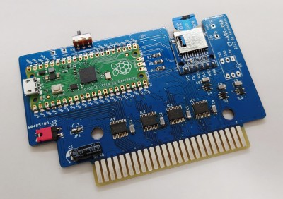

# CT-ARK
by Harumakkin. 2023/10/02

**fig.1 CT-ARK-04A**

## What's is this?
- CT-ARKは、MSX用ROMカートリッジエミュレーターです。32KB ROMカートリッジの内容を読みだしてSDカード内にファイルとして保存したり、その保存ファイルを使用したROMカートリッジとして動作させたりすることができます。
- ver0.84現在、32KB以下の容量のROMカートリッジのみ模倣できます。
- CT-ARKカートリッジの上部にはモードスイッチがあり、CT-ARK MENUを起動させるか、設定したROMカートリッジファイルで起動するかを選択することができます。
- CT-ARK MENUではSDカード内のファイルを一覧表示するする、選択ROMルを削除する、Slot2に挿したROMカートリッジを読み込んでSDカードにファイル保存する、起動するROMカートリッジファイルを選択する、を行うことができます。
- SDカードを抜いた状態で使用するとRAMカートリッジとして動作します。

## ４つの動作モード
CT-ARKは４通りの動作モード持っています。どの動作モードで起動するかは、モードスイッチとSDカードの有無の状態で決まります。

|Mode|動作|モードスイッチ|SDカード|LED|
|:-:|:-|:-:|:-:|:-:|
|1|192KBマッパーRAM|左|無し|点灯|
|2|32KB ROM(FlushROMから起動)(*)|右|無し|点灯|
|3|32KB ROM(microSDから起動)|左|有り|点灯|
|4|CT-ARK MENU|右|有り|点灯|

(*)起動可能なROMイメージが書き込まれていない場合は、Mode.1 192KBマッパーRAMとして動作します。

### ModeNo.1 192KBマッパーRAM
192KBマッパーRAMカートリッジとして動作します。

### Mode.2 32KB ROM(FlushROM)
PicoのFlushROMに書き込んだROMイメージを起動します。ROMイメージはCT-ARK MENUモードでPicoのFlushROMに書き込みます。FlushROMに書き込むんでいるので起動時にSD Cardは必要ありません。正直 Mode.3 32KB ROM(SD Card)のモードがあるためこのモードは必要ありません。将来MegaROMに対応させるための練習として実装しました。
このモードは、Picoのファームウェア ct-ark.vxxx.240mhz.uf2 を使用する必要があります(240MHz動作）

### Mode.3 32KB ROM(SD Card)
電源ON時に CT-ARK MENUで指定しておいたROMイメージをSD Cardから読み込んで実行します。最も使用するモードでしょう。

### Mode.4 CT-ARK MENU
Srot2に挿した32KB ROMカートリッジからイメージを読みだしてROMイメージをファイルとしてSD Card に保存したり、SD Cardに保存されたROMイメージファイルを、Mode.3 32KB ROMで起動するように指定したりすることを行うモードです。このモード行える機能を下記に列記します。
- SD Card保存の.ROMファイル、BASファイルの一覧
- Mode.2 32KB ROM で起動する.ROMファイルを指定する
- SD Card内のファイルの削除
- Srot2 32KB ROMカートリッジ を ファイルにしてSD Cardに保存する
- BASファイル(BASIC プログラム)を.ROMファイルに変換する

## CT-ARKを作る
部品表にある部品の収集、プリント基板の製造、組み立て、ファームウェアの書き込みの作業が必要です。完成品はありません。 PCBを発注できて、表面実装部品をはんだ付けできて、Raspberry Pi Picoにu2fファイルを書き込みができる必要があります。
- 部品表（CT-ARK-04A_部品表.xlsx）
- 回路図（CT-ARK-04A_schematic.pdf）
- ガーバーデータ(gerber_CT-ARK-04B.zip)
- microSDカード
- Raspberry Pi Pico ファームウェア ct-ark.vXXX.240mhz.uf2 
- CT-ARK MENU プログラム ct-ark.sys

Raspberry Pi Picoに書き込むファームウェア(u2fファイル)は、125Mhz版と240Mhz版の２種類があります。（ファイル名のXXX部分はバージョン番号）。
- ct-ark.vXXX.125mhz.uf2
- ct-ark.vXXX.240mhz.uf2

後者のct-ark.vXXX.240mhz.uf2で問題ないと思います。前者の125MHz版は Mode.3 32KB ROM(microSDから起動)が正しく機能しないのみです。

## CT-ARKを使う
### microSD カードの用意とセットアップ
1. microSDカードを FATかFAT32でフォーマットします(exFAT、NTFSは使用できません）。動作確認済みの容量は32GBです。それ以上は試したことがありませんが、32GBより大きなサイズのカードを使用して使用できなかった場合は、プライマリパーテーションを32GB以下に切り直せば多分使用できるかなと思います。
2. microSDカードに ct-ark フォルダを作成し、そのフォルダに、 ct-ark.sys ファイルをコピーしておきます。
3. microSDカードをCT-ARKのスロットにセットします。

### ROMカートリッジの内容を取り込んでみる
1. MSX本体のSlot1にCT-ARKをセットします
2. MSX本体のSlot2にカートリッジ(32KB以下のROM。メガロムには現状対応していません）セットします
3. モードスイッチを右にして本体の電源を入れます
4. CT-ARK MENUが表示されます
5. [RETURN]キーを押してメニューを開きます
6. "32KB ROM(Slot2) -> ROM FILE" を選択します
7. ファイル名を入力し、[RETURN]キーを押します(英数8文字で、かなやカナは不可）
8. OKを選択すると、Slot2にカートリッジの読み出しとSDカードへのファイル保存が始まります（終了まで約2分ほどかかります）
9. 終了すると、ファイル一覧に"入力した名称.ROM"がひとつ追加されます。取り込みはここで完了です。
### 取り込んだROMイメージで起動する
10. 追加されたファイルを上下キーで選択し[RETURN]キーを押してメニューを開きます
11. "SET to boot ROM file" を選択します
12. 画面下に、"ROM:選択したファイル名" が表示されればセット完了です。
13. モードスイッチを左に切り替えて、本体の電源を入れなおします
14. 取込んだROMイメージでMSXが動作します。
15. 他のROMイメージで起動したい場合は、CT-ARK MENUで起動して 10. 操作を再度行います
### BASICプログラムをROMファイル化する
1. BASICプログラム（非ASCII）を、拡張子 .BAS としてmicroSDのct-arkフォルダに格納します
2. CT-ARK MENU（モードスイッチを右）を起動します
3. 該当の.BASを選択し、[RE、、URN]キーを押してメニューを開きます
4. "BAS FILE -> ROM FILE"を選択します。
5. 保存したいファイル名を入力します（既存ファイル名と重複しないよう注意してください）
6. ファイルが生成され、ファイル一覧にファイル名.ROMが追加されます。
7. "SET to boot ROM file"で指定すれば、起動できます。
8. 余禄：出来上がったROMファイルは、32KBのサイズがあり、前半16KBは不定値が格納されています。ヘッダ情報とBASICプログラム本体は後半16KBに格納されています。blueMSX等でもそのまま使用できます
### ファイルを削除する
1. 該当ファイルを選択してメニューから、"DELETE ROM file"を選択してください。
### 取り扱いファイル個数
CT-ARK MENUのファイルを一覧では54個までファイルを表示できます。ページ切り替えとかスクロールとか、機能を強化すれば、取り扱えるファイルの上限数はなくなるでしょうが、現状はそこまでつくり込んでいません

## LICENSEと利用に関する注意事項
CT-ARKのファームウェアとそのソースコード、回路図データおよび資料ファイルは MIT License で配布されます。ただし、CT-ARK は、FatFsを使用しています。FatFsのソースコードの扱いに関してはFatFsのLICENSEに従ってください。
本作品は同人ハードウェア＆ソフトウェアです。本作品の設計およびソフトウェアは品質を保証していません。MSX本体やその周辺機器が故障、破損したとしても自身で責任を負える方のみ本作品をご利用ください。特にハードウェアの製作を伴いますのでリスクがあります。製作の腕に自身のある方のみご利用ください。
本作品の設計資料とソースコードの改変や改造、また、別の作品への利用、商用利用は自由です。ただし、1. 2.の制限を超える利用は各自でその責任と義務を負ってください。

## CT-ARKが使用しているソフトウェア
FatFs
Copyright (C) 20xx, ChaN, all right reserved. http://elm-chan.org/fsw/ff/00index_e.html

## 余談
CT-ARK製作の経緯：RaspberryPiPicoを使ったＭＳＸ関連の何か、を製作したかったそれだけです。ROMカートリッジエミュレーターをつくることだけを目的としていたらRaspberryPiPicoは使用しなかっただでしょう。

